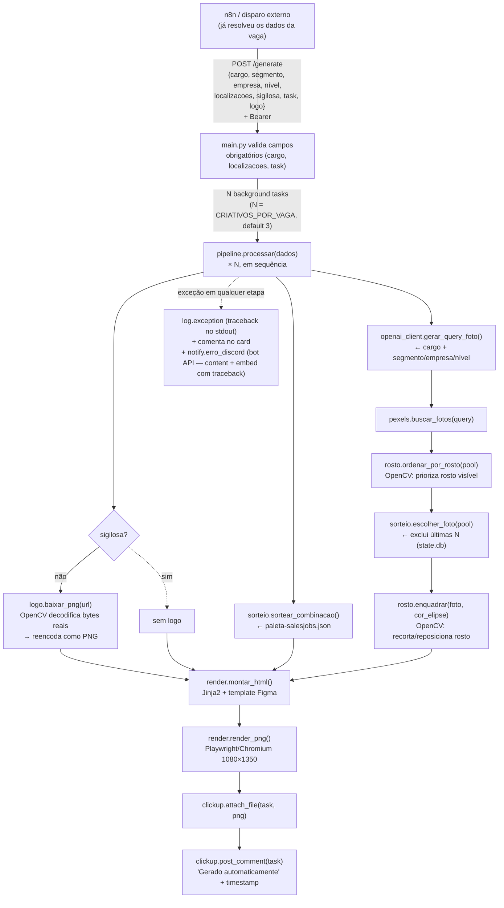

# gerador-arte-salesjobs (Python)

Reescrita em Python do fluxo de geração automática de artes de vaga Salesjobs
(sucessor do `mvp-arte` em Node). A API fica esperando `POST /generate` com os
dados da vaga já resolvidos por quem chama (n8n) — cargo, segmento, empresa,
nível, localizações, se é sigilosa, o `task` (ID do card no ClickUp) e a URL
da logo da contratante — e cuida do resto: sorteio de cor (paleta oficial do
Figma) e foto (busca dinâmica na Pexels, com query gerada por GPT a partir do
cargo/contexto da vaga, excluindo as últimas N usadas), conversão da logo pra
PNG, render HTML→PNG 1080×1350 e anexo no card do ClickUp com "Gerado
automaticamente" + timestamp. Cada chamada dispara `CRIATIVOS_POR_VAGA`
pipelines independentes (default 3) — cada um sorteia cor/foto próprias e
anexa uma arte no card. Falhas técnicas: retry 3x com backoff; persistindo,
comenta no card, loga o traceback e notifica o Discord (bot API —
`DISCORD_BOT_TOKEN` + `DISCORD_CHANNEL_ID`). Sem dedup entre chamadas.

## Rodando

    pip install -r requirements.txt
    playwright install chromium
    cp .env.example .env   # preencher
    uvicorn app.main:app --port 3001 --reload

    python -m tests.test_smoke   # partes puras, sem rede

Docs interativas dos endpoints com o servidor no ar: Swagger UI em
`http://localhost:3001/docs`, ReDoc em `/redoc`, schema OpenAPI em
`/openapi.json`. Use o botão **Authorize** do Swagger pra mandar o
`GENERATE_TOKEN` (Bearer) nas chamadas de teste.

Docker: a imagem base `mcr.microsoft.com/playwright/python` já traz o Chromium;
o Dockerfile instala a fonte Open Sans (obrigatória — é a fonte do template).

## Fluxo (como está hoje)

Diagrama editável em `docs/fluxo-arquitetura.excalidraw` — abra em
[excalidraw.com](https://excalidraw.com) (menu → Open) ou com a extensão
"Excalidraw Editor" do VS Code/JetBrains. Versão rápida em Mermaid abaixo,
pro preview direto no GitHub/IDE:

Não há mais busca em sistema externo de vaga (Foursales) nem webhook nativo do
ClickUp — quem chama já manda tudo pronto; o ClickUp só é usado pra anexar o
resultado.

## Estrutura

    app/main.py      FastAPI: /generate (Bearer, payload completo da vaga; dispara
                     CRIATIVOS_POR_VAGA pipelines), /health, Swagger em /docs,
                     config de log e handler global de exceção
    app/pipeline.py  orquestração — mapa dos critérios de aceite comentado no topo;
                     rastreia a `etapa` atual pra logar/notificar onde quebrou
    app/notify.py    erro_discord() — POST no canal do Discord (bot API v10):
                     content de alerta + embed vermelho com contexto e traceback
    app/clickup.py   API v2: só comentário e anexo (dados da vaga já vêm no payload)
    app/logo.py      baixa a URL da logo (sem extensão) e reencoda como PNG via
                     OpenCV — não depende do Content-Type/extensão da URL
    app/pexels.py    busca de fotos na Pexels API (query dinâmica, URL pública)
    app/openai_client.py  GPT: gera a query de busca da foto (Pexels) por cargo/contexto
    app/rosto.py     reordena o pool do Pexels priorizando rosto visível E
                     reenquadra a foto vencedora (recorte/preenchimento no
                     servidor) pra garantir o rosto no lugar certo do anel —
                     OpenCV, detecção local sem custo de API; ver comentário
                     do módulo pra geometria do recorte do template
    app/sorteio.py   random.choice da combinação de cor; foto = top do pool Pexels
                     já reordenado por rosto.py (exclui últimas N usadas)
    app/state.py     SQLite: fotos usadas entre execuções (STATE_DB → volume!)
    app/render.py    Jinja2 + Playwright (Chromium singleton, retry 3x)
    templates/       template capturado do Figma (1080×1350, Open Sans)
    config/          paleta-salesjobs.json — 4 combinações extraídas do Figma

## Pendências para fechar com o time

1. **Canal de notificação** — bot do Discord no servidor do time com permissão
   de enviar mensagem no canal de alertas; `DISCORD_BOT_TOKEN` +
   `DISCORD_CHANNEL_ID` no env (falhas do pipeline e erros não tratados da API
   caem lá, com `content` de alerta + traceback no embed).
2. **Formato 1080×1350 (4:5)** — atende o mínimo de 1080px do card, mas não é
   quadrado; confirmar se 1080×1080 exato é requisito.

## Resolvidas

- **Card branco à direita do template** — puramente decorativo: bloco de cor
  de acento (`card_logo_fundo` da combinação sorteada), presente nas 8
  variações do Figma independente da flag sigilosa. Sem relação com
  requisitos/benefícios; nenhuma mudança de código necessária.
- **Asset do logo salesjobs do rodapé** — `templates/logo_Salesjobs.svg`
  (fornecido pelo usuário), embutido como data URI em `config.LOGO_SALESJOBS_URL`
  a partir do arquivo local; não depende mais de env var.
- **Rosto cortado na foto** — três fatores corrigidos juntos:
  1. `.foto-extensao` (retângulo abaixo do círculo, mesma foto com offset
     hardcoded) foi removida — só funcionava pra uma foto específica do pool
     antigo do Drive e criava pedaços de corpo desconexos com fotos dinâmicas
     do Pexels.
  2. `.foto-circulo` e `.elipse` viraram círculos CONCÊNTRICOS de verdade
     (mesmo centro, `.elipse` com raio menor) em vez de elipses deslocadas —
     o recorte em "C" tinha um bug visual de afunilar torto (mais largo num
     lado, mais estreito no outro); agora é um anel de largura constante do
     topo até a base, igual à peça de referência ("Consultor de Vendas").
  3. `app/rosto.py` escolhe, entre os candidatos do Pexels, o que tem rosto
     melhor posicionado — pontuação por distância do centro (fora do círculo
     da elipse) e dentro da área que sobrevive ao corte do canvas.
  4. `app/rosto.py:enquadrar` recompõe a foto vencedora no servidor
     (Python/OpenCV) pra garantir o rosto no terço superior esquerdo do anel
     — o `object-position` do CSS não resolve isso sozinho: testado
     empiricamente que o eixo X não tem efeito nenhum aqui (container
     quadrado + foto retrato = `cover` já usa 100% da largura, sem sobra pra
     "empurrar"). O recorte no servidor preenche com a cor da elipse
     (`combinacao["elipse"]`) onde não sobra foto de verdade — isso cai quase
     todo debaixo da própria elipse, então normalmente nem aparece.
  5. Detecção de rosto trocada de "maior área" pra "maior confiança"
     (`detectMultiScale3(outputRejectLevels=True)`) — evita falso positivo em
     estampas/texturas que pareçam rosto (ex.: desenho numa camiseta) sendo
     escolhidas por serem maiores que o rosto de verdade, que tem confiança
     bem mais alta.

  Ainda não é 100% garantido: cargos de nicho às vezes não têm nenhum
  candidato com rosto detectável no banco do Pexels.
- **Payload completo em `/generate`** — quem chama (n8n) já resolve os dados
  da vaga (cargo, segmento, empresa, nível, localizações, sigilosa, task,
  logo) num único payload; removida a busca em Foursales (`vaga.py`) e o
  webhook nativo do ClickUp (`/webhooks/clickup`), que ficaram obsoletos —
  o ClickUp agora só é usado pra anexar o resultado. Ver `docs/fluxo-arquitetura.excalidraw`.
- **Logo do cliente** — o campo é `logo` (URL assinada do S3, sem extensão de
  arquivo). `app/logo.py` baixa os bytes e usa OpenCV pra decodificar pelo
  conteúdo real (não pela URL/Content-Type) e reencodar como PNG — evita
  depender do que o S3 devolve de Content-Type.
- **Bug do `.env`** — `GENERATE_TOKEN=`/`NOTIFY_WEBHOOK_URL=` vazios com
  comentário inline (`# texto`) faziam o `python-dotenv` engolir o comentário
  inteiro como se fosse o valor (quebrava com acentuação, e endpoint "aberto"
  na prática exigia esse token-fantasma). Corrigido movendo os comentários
  pra linha de cima.
